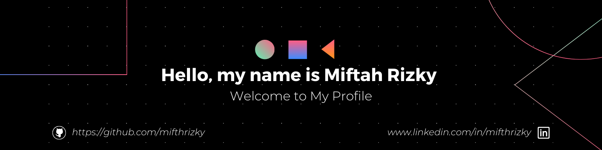

<!--Banner-->

<!--Night Owl image-->

  

<!--Header Name-->
#  I'ᴍ Miftah! 
*Welcome to My Github Profile*
  

<!--Start Intro-->               

I'm a Web Developer and Cyber Security Enthusiast. 

- ✨ Student of life :)
- 👨‍🎓 I'm a student at Bandung Polytechnic of Manufacturing.
- 🌱 I'm currently learning many things, I believe that everyday is a learning opportunity.
- ✍ I write technical blogs, You can visit my blog site at [DEV](..).
- ❤ Contributing to Open Source.
- 💻 Visit my [Portfolio](..) for more details about me.
<!--End Intro-->

<!--Profile Count Badge-->

  

---

<!--Languages and Tools Section-->       
<h2 align="center">Tᴇᴄʜ sᴛᴀᴄᴋ & Lᴀᴛᴇsᴛ ʙʟᴏɢs</h2> 
<picture>
  <source media="(prefers-color-scheme: dark)" srcset="./Skills_Animation_Dark.gif">
  <source media="(prefers-color-scheme: light)" srcset="./Skills_Animation_White.gif">
  
</picture>
 

<h3 align="left">Current Learning</h3>
<ul align="left">
  <li>Deepening my knowledge in Machine Learning and AI.</li>
  <li>Cyber Security.</li>
  <li>Improving my skills in programming.</li>
</ul>
  
<h3 align="left">Latest Blog Posts</h3>
<!-- <ul align="left">
  <li><a href="#">😎Debug Like a Pro in 2025🧑‍💻</a></li>
  <li><a href="#">✨Open-Source Hidden Gems v2🤯</a></li>
  <li><a href="#">🫵You Should Try These Tools In Your Next Project</a></li>
</ul> -->
 
 
 
 

<picture>
  <source media="(prefers-color-scheme: dark)" srcset="https://raw.githubusercontent.com/mifthrizky/mifthrizky/output/github-snake-dark.svg" />
  <source media="(prefers-color-scheme: light)" srcset="https://raw.githubusercontent.com/mifthrizky/mifthrizky/output/github-snake.svg" />
  
</picture>
<!--Footer--> 

  

